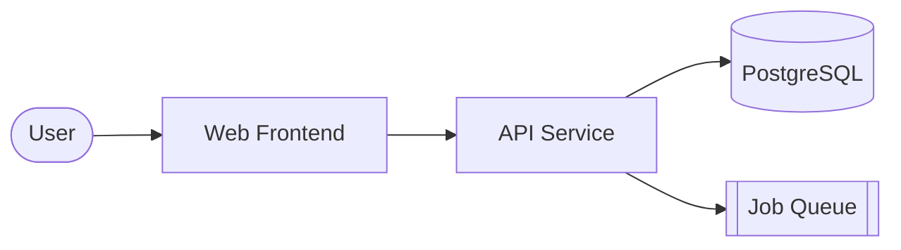
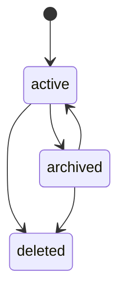

# Document Architecture

Maintain one living `.agents_workspace/ARCHITECTURE.md` — the always-current picture of the system.
It is **mainly Mermaid diagrams** plus a **Key Decisions** log that holds the durable, cross-version
"why". Keep it in sync: when a version re-plan changes the system's shape, update the affected
diagram and append any new decision in the same change.

This is the durable counterpart to a plan's §02 architecture diagram. The plan visualizes one
version's *change*; `ARCHITECTURE.md` shows the *whole current system* and the decision trail behind
it. It absorbs what used to be standalone ADRs — there is no separate `docs/adr/` tree.

## Rules

- **Mermaid, never ASCII art.** Diagrams must render and stay diffable.
- **Show what exists, not what's aspirational.** If it isn't built, it isn't in the diagram.
- **One line of prose per diagram** stating what it shows — never a wall of text.
- **Keep each diagram small and focused.** Split an overloaded diagram rather than cramming.
- **Update on shape change, not on every commit.** A diagram is stale only when the system no
  longer matches it.

## The standard diagram set

Include the diagrams that apply; omit ones the system doesn't have. Order them outside-in.

| Diagram | Mermaid type | Shows |
|---------|--------------|-------|
| System context | `flowchart` | External actors and systems around the boundary — who/what talks to it |
| Components | `flowchart` | Internal pieces (services, db, frontend, queues, jobs) and how they connect |
| Key flows | `sequenceDiagram` | 1–3 critical request/lifecycle paths end to end |
| Data model | `erDiagram` | Core entities and relationships (mirrors `domain-modeling` entities) |
| State machines | `stateDiagram-v2` | Legal status transitions for key entities (mirrors `domain-modeling` status rules) |



State-machine diagrams must match the `domain-modeling` rule that not all transitions are legal —
draw only the legal edges:



## Key Decisions

The durable record of significant architectural decisions — ones that would confuse a future
developer without context, or that reversing would require a migration or refactor. This is the
single home for decision rationale; record one whenever you choose a framework/runtime/persistence
strategy, pick between fundamentally different patterns, plan a major dependency upgrade, or reverse
a prior decision in a new version.

Append entries to a `## Key Decisions` section at the bottom of `ARCHITECTURE.md`, newest last:

```markdown
### YYYY-MM-DD — <Short, Descriptive Title>

**Status:** Accepted | Superseded by <date title>
**Context:** Problem, constraints, and options considered.
**Decision:** What was decided — explicit and unambiguous.
**Consequences:** Trade-offs, limitations, follow-ups.
```

- **Never delete a decision.** To change one, append a new entry and mark the old one
  `Superseded by <date title>`. The trail is the cross-version narrative.
- **Never silently diverge** from an accepted decision — supersede it on the record first.
- Keep entries short. The diagrams carry the structure; these carry the reasoning.

## Storage

`.agents_workspace/ARCHITECTURE.md`. For a large system, the diagram set may
move to `.agents_workspace/architecture/` with one file per view, but the `## Key Decisions` log stays in a
single file so the decision trail is greppable in one place.
