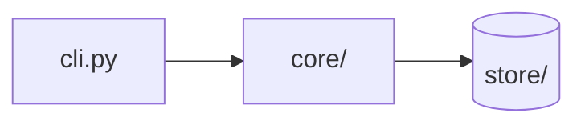

# Explain Codebase

One pass over the repository produces one file — `.agents_workspace/CODEBASE_EXPLAINED.md` — that
explains what every component does and how they connect. The reader is a developer or agent who has
never seen the repo and will change it tomorrow, so the file must be readable top to bottom, not
just greppable.

The hard requirement is **accounting**: every file in the repo belongs to an explained component, to
an explicit group rule, or to a named exclusion. A file that belongs to none of the three is a gap
you report, not an omission you make quietly.

## Not the same as

| Want | Use |
|------|-----|
| One line per path, clickable tree, fast orientation | `ceh-dev-tools:repo-tree-mapper` agent |
| Diagrams of the system's shape + decision log | `ceh-architecture:document-architecture` |
| Docs for people who *use* or *operate* the product | `ceh-documentation:user-operator-guide` |
| Explain one subsystem to someone who is in the session and can say "still blurry" | `ceh-agent-coding-contract:explain-until-understood` |
| Explain what is in the repo and how it works, component by component | **this skill** |

Running the mapper first is cheap and gives a good inventory to explain against — but never required.

## Granularity

**Default: component level.** A component is a directory or a cohesive set of files with one
responsibility — `src/api/`, `store/`, the CI workflows, the packaging config. Individual files are
named inside a component's explanation only when they carry weight: entry points, the file holding
the core logic, a file whose role contradicts its name.

**Per-file only on an explicit ask** — "per file", "file by file", "every file", "explain each
file". Then every non-excluded file gets its own entry under its component. Do not volunteer this
mode: on a large repo it multiplies both the reading and the document length, and the result is a
worse orientation doc than the component view.

If the ask is per-file for one area only ("explain every file in `src/api/`"), do it there and stay
at component level everywhere else. Say which mode you used in the doc's header line.

## Output contract

- **Path:** `.agents_workspace/CODEBASE_EXPLAINED.md`. Create the directory if missing. Honor any
  path the user names instead.
- **Git-ignored, never tracked.** The doc is a regenerable local artifact, not repo content:

  ```bash
  git check-ignore -q .agents_workspace/CODEBASE_EXPLAINED.md \
    || echo '.agents_workspace/CODEBASE_EXPLAINED.md' >> .git/info/exclude
  ```

  `.git/info/exclude` is the right home — it ignores the file without modifying a tracked
  `.gitignore`, so no teammate inherits the rule and no repo file changes. Use the repo `.gitignore`
  instead only when the user asks for a shared rule. If a previous run left the file tracked
  (`git ls-files --error-unmatch <path>` succeeds), untrack it with `git rm --cached <path>` before
  writing, and say so.
- **Overwrite** an existing one — it is generated, never hand-maintained.
- **The output file is the only write.** This skill reads the repo; it changes nothing else in it.

## Scope

Build the inventory from version control, not from a manual walk:

```bash
git ls-files                               # tracked files
git ls-files --others --exclude-standard   # untracked, not ignored
```

Outside a git repo, fall back to `find . -type f` with the usual noise pruned (`node_modules/`,
`.venv/`, `__pycache__/`, `dist/`, `build/`, `.next/`).

Excluded by default — and **each exclusion is named in the doc**, never silent:

- Agent and session workspaces: `.agents_workspace/`, session artifacts under `.claude/`
- Lockfiles, vendored dependencies, build output, generated code
- Binary assets — count and classify them, do not read them
- Anything the user names as out of scope

Everything else belongs to a component. Repetitive sets inside a component are collapsed to a group
rule rather than enumerated, in both modes:

> `migrations/` — 42 sequential Alembic revisions, `001_init` … `042_add_audit`; each adds tables
> or columns and is applied in filename order.

## Workflow

1. **Inventory.** Run the listing above. Record the total count; you will reconcile against it.
2. **Partition into components.** Every non-excluded file lands in exactly one. Rank the
   components: entry points first, then core domain, then supporting code, then config and repo
   meta. The ranking becomes the document's order.
3. **Budget the reading.** Read in full: entry points, manifests, configs, and one or two
   representative files per component. Skim the rest; grep imports and call sites when a
   component's role is ambiguous. A 500-file repo does not need 500 reads — but every claim in the
   doc must be one you can point at a file for.
4. **Explain each component** using the four-part shape below.
5. **Trace 1–3 end-to-end flows** — a request, a build, a CLI invocation — naming the components
   and files each step passes through. This is what turns a list of parts into an explanation.
6. **Reconcile.** Diff the inventory against the doc. Every path assigned to a component, a group
   rule, or a named exclusion. Report the numbers in the Accounting section.

## The four-part shape

Every component gets these four, in this order:

- **What it is** — one sentence of responsibility.
- **What's inside** — the notable files and what they actually do; the rest as a group rule. In
  per-file mode, one line per file instead.
- **How it connects** — what it calls, what calls it, what data it owns.
- **Before you change it** — the non-obvious constraint: an invariant, an ordering requirement, a
  duplicated copy elsewhere, a generated file, a config that must move with it.

A description that restates the name is a failure. `utils.py — utilities` says nothing; say *which*
utilities and who imports them. Write what the reader cannot guess.

## Template

````markdown
# Codebase Explained — <repo-name>

_Generated by `explain-codebase` on <YYYY-MM-DD> at commit `<sha>`. Component-level detail._
_<C> components · <N> files accounted for · <K> excluded._

## What this repo is

2–4 sentences: what it does, who it is for, what kind of project it is, what stack it runs on.

## How it fits together



One paragraph naming the moving parts and the direction things flow.

## Components

### `src/api/` — HTTP surface

**What it is.** Route handlers; no business logic.
**What's inside.** `auth.py` issues the JWT every other route verifies; `deps.py` holds the FastAPI
dependencies (DB session, current user). The remaining 9 modules are one resource each, all built on
the same `deps.py` pair.
**How it connects.** Registered by `main.py` on startup; calls `services/`. Owns no state.
**Before you change it.** Route paths are duplicated in `tests/conftest.py`.

## Key flows

### Authenticated request

1. `main.py` → routes registered at startup
2. `api/deps.py` verifies the token
3. `services/user.py` loads the record
4. `store/pg.py` runs the query

## Repo meta

The support cast as group rules — CI workflows, packaging config, editor and lint config, license.

## Gaps and oddities

Factual observations only: dead code, missing CI, a component whose purpose could not be determined
and what was checked.

## Accounting

| | Count |
|---|---|
| Files in inventory | N |
| Assigned to a component | X |
| Covered by a group rule | Y |
| Excluded (`.agents_workspace/`, lockfiles, binaries) | Z |
````

## Rules

- **Evidence over inference.** Unclear purpose is written as "purpose unclear — checked imports and
  call sites, no references found", never guessed at. Never invent a responsibility.
- **Not a code review.** No quality verdicts, no refactor proposals. Problems you notice go into
  *Gaps and oddities* as facts.
- **Describe what exists today**, not what was planned or is half-built.
- **Don't paste code.** A signature or a three-line snippet is the ceiling. A literal that *is* the
  behavior — a constant, a threshold, a regex, a status string — is quoted verbatim and does not
  count against that ceiling; paraphrasing a value loses the mechanism.
- **Depth follows weight.** Core components earn paragraphs; repo meta earns a clause.
- **Regenerate, don't patch.** Re-run the skill and overwrite when the repo has moved on.
