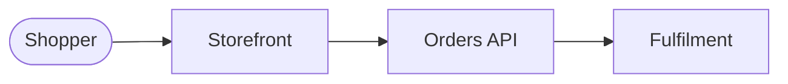
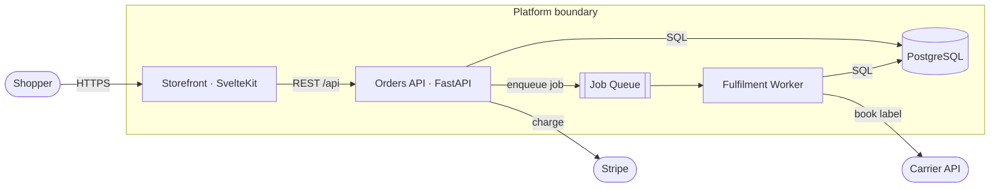
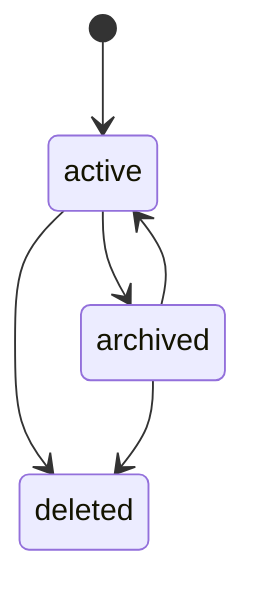

# Document Architecture

Maintain one living `.agents_workspace/ARCHITECTURE.md` — the always-current picture of the system.
It opens with a 3-second **Overview**, then is **mainly Mermaid diagrams**, then a
**Key Decisions** log that holds the durable, cross-version "why".

This is the durable counterpart to a plan's §02 architecture diagram. The plan visualizes one
version's *change*; `ARCHITECTURE.md` shows the *whole current system* and the decision trail behind
it. It absorbs what used to be standalone ADRs — there is no separate `docs/adr/` tree.

## Rules

- **Mermaid, never ASCII art.** Diagrams must render and stay diffable.
- **Show what exists, not what's aspirational.** If it isn't built, it isn't in the diagram.
- **One line of prose per diagram** stating what it shows — never a wall of text.
- **One screen per diagram is the ceiling.** When one stops fitting, split it by subsystem — never
  shrink the labels to buy room.
- **Update on shape change, not on every commit.** A diagram is stale only when the system no
  longer matches it; then the diagram and any new decision land in that same change.

## The 3-second read

`ARCHITECTURE.md` opens with an `## Overview` section a newcomer absorbs in under three seconds,
before any diagram. It answers "what is this thing?" and nothing else. Exactly two parts:

1. **One sentence** — what the system does, and for whom: an end user, an operator, or the
   developer importing it. Problem-domain words only.
2. **One line of shape** — the whole system as a single left-to-right flow, 3–6 nodes.

````markdown
## Overview

Shoppers browse a catalogue and place orders; staff fulfil them from an admin console.


````

- **Three seconds is the acceptance test.** One sentence, one flow line, no scrolling. If the reader
  has to parse a branch or a legend, it failed — cut until it passes.
- **Domain nouns, not codebase nouns.** `Orders`, `Fulfilment` — never `OrderAggregateService`,
  and never a framework or database name; those belong in the Components diagram.
- **Linear, never branching.** The overview is the spine. Externals, alternate paths, and every
  other actor go in the System context and Components diagrams — that is what they are for.
- **Rewrite it only when the system's purpose changes.** The spine survives most refactors; if it
  churns commit to commit, it is carrying detail that belongs in a real diagram.
- **An existing doc without one gets one first.** When updating an `ARCHITECTURE.md` that predates
  this section, write the Overview before any other edit — it is the cheapest part to produce and
  the part most readers never get past.

## The standard diagram set

Include the diagrams that apply; omit ones the system doesn't have. Order them outside-in.
**System context earns a separate diagram only when the externals are too many to sit legibly on
Components.** Otherwise draw them on Components, outside the boundary, as the example below does.

| Diagram | Mermaid type | Shows |
|---------|--------------|-------|
| System context | `flowchart` | External actors and systems around the boundary — who/what talks to it |
| Components | `flowchart` | **The expanded Overview** — every internal piece and what crosses each connection (rules below) |
| Key flows | `sequenceDiagram` | 1–3 critical request/lifecycle paths end to end |
| Data model | `erDiagram` | Core entities and relationships (mirrors `domain-modeling` entities) |
| State machines | `stateDiagram-v2` | Legal status transitions for key entities (mirrors `domain-modeling` status rules) |

**Components is the Overview with the detail put back** — same system, no longer a line. The
Overview is a spine *by rule*; Components branches, fans out, and loops back wherever the real
system does. There is no separate "expanded overview" diagram; when you want more than the spine,
you want this one:

- **Branch freely — that is the point.** The Overview's one-line constraint does not carry over.
  Fan-out, loop-backs, and every external the spine had to drop belong here.
- **Label every edge** with what crosses it — protocol, payload, or verb. A bare arrow says two
  things touch, not how; that is the difference between a picture and a diagram.
- **Draw the trust or deployment boundary as a `subgraph`.** Anything outside it is someone else's
  system: you cannot change it, and it fails independently.
- **Name the technology on the node** (`Orders API · FastAPI`). This is the diagram where stack
  names belong.
- **Skip it if it adds nothing.** If Components would be the Overview plus a node or two, the system
  is small enough that the Overview *is* the whole picture — ship it alone and move on.



State-machine diagrams must match the `domain-modeling` rule that not all transitions are legal —
draw only the legal edges:



## Key Decisions

The durable record of significant architectural decisions — ones that would confuse a future
developer without context, or that reversing would require a migration or refactor. This is the
single home for decision rationale; record one whenever you choose a framework/runtime/persistence
strategy, pick between fundamentally different patterns, plan a major dependency upgrade, or reverse
a prior decision in a new version.

Append entries to a `## Key Decisions` section at the bottom of `ARCHITECTURE.md`, newest last:

```markdown
### YYYY-MM-DD — <Short, Descriptive Title>

**Status:** Accepted | Superseded by <date title>
**Context:** Problem, constraints, and options considered.
**Decision:** What was decided — explicit and unambiguous.
**Consequences:** Trade-offs, limitations, follow-ups.
```

- **Never delete a decision.** To change one, append a new entry and mark the old one
  `Superseded by <date title>`. The trail is the cross-version narrative.
- **Never silently diverge** from an accepted decision — supersede it on the record first.
- Keep entries short. The diagrams carry the structure; these carry the reasoning.

## Storage

`.agents_workspace/ARCHITECTURE.md`. For a large system, the diagram set may
move to `.agents_workspace/architecture/` with one file per view, but the `## Overview` and
`## Key Decisions` sections stay in `ARCHITECTURE.md` itself — the spine and the decision trail must
remain readable and greppable in one place.
