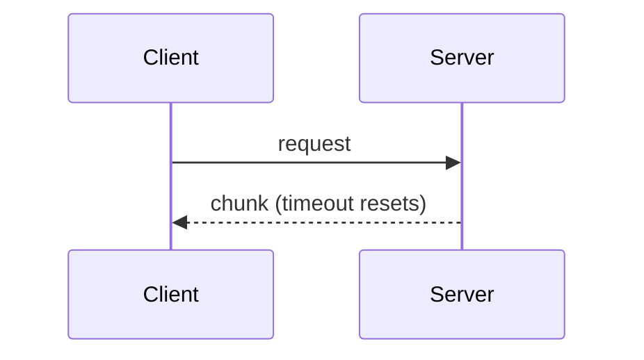

# Write Concept Docs

Concept pages are where an experienced user goes to learn **why** — why the timeout is per chunk,
why there is no sync client, why config files lose to env vars. They are also what keeps every
other page short: a term explained once here is linked from guides and reference instead of being
re-explained on each.

Work against `<root>` — the project path handed over by the caller, or the current working
directory. Write under `<root>/docs/concepts/`. Read `references/docs-standard.md` before writing:
it fixes the file naming, page anatomy, Markdown and link rules, markers, and report format that
every page here follows.

## Step 1 — Pick the concepts

A concept earns a page when **at least two guide or reference pages would otherwise have to explain
it** — on the strength of its model and behavior alone. A concept with no recorded rationale still
gets its page. Candidates, in the order to check:

1. The core objects a user creates or receives (the public classes and resources, and how they
   relate).
2. Lifecycle — what is created, when it is valid, what cleans it up.
3. Data flow — what happens between the user's call and the result.
4. Configuration precedence — where settings come from and which source wins.
5. The error and retry model — what fails, what retries, what the user must handle.
6. The security and trust model, when there are credentials or untrusted input.

Three to seven concepts is typical. More than ten means some are reference entries in disguise.

## Step 2 — Find the rationale

Collect the "why" before writing, ordered by how much to trust each source:

| Source | How |
|--------|-----|
| Design records | ADRs (`docs/adr/`, `docs/decisions/`), `ARCHITECTURE.md` Key Decisions, decision logs |
| Merge and commit bodies | `git -C <root> log --grep='<term>' --format='%h %s%n%b'`; `git -C <root> log -S'<symbol>' --reverse` for the commit that introduced a behavior |
| Code comments | Comments next to the behavior, especially `NOTE`, `WHY`, and "we do X because" prose |
| Changelog | `CHANGELOG.md` entries that changed the behavior, and the breaking-change notes |
| The code itself | A constraint the code makes visible (a lock, a bounded queue, a version check) — label it as inferred |

**Never invent a reason.** A plausible-sounding rationale that is wrong is worse than none: an
expert will act on it. When no source states why, write what the behavior *is* and its
consequence, and put `[VERIFY: why <behavior>]` in the "Why" section so the owner can fill it,
followed by `Source: none found in the repository.`

## Step 3 — Write each page

````markdown
# CO-03 — Streaming

[← Concepts](index.md)

<One or two sentences: what this concept is and when a user runs into it.>

## The model

<How it works, in the user's terms. A Mermaid diagram when there is structure or a sequence.>



## Terms

- **Chunk** — <definition, linking its reference entry>

## How it behaves

<Defaults, edge cases, limits — each linking the reference entry that holds the exact values.>

## Why it works this way

<The decision, the alternative that was rejected and why, the trade-off accepted.>

Source: <link to the ADR, commit, or changelog entry>.

## What this means for you

- <Practical consequence, linking the guide that handles it.>

---

[← CO-02 Sessions](CO-02-sessions.md) · [Concepts](index.md) · [CO-04 Errors and retries →](CO-04-errors.md)
````

- **One concept per page, two screens at most.** Longer means it is two concepts.
- **Explain, do not instruct.** No numbered procedures — a task belongs in a guide, and the page
  links to it.
- **Exact values live in the reference.** Say "the timeout resets per chunk" here, and link to the
  reference for the default.
- **Every "Why" names its source** or carries a `[VERIFY: …]`. A section explaining several
  decisions gives each its own paragraph and its own `Source:` line.

## Step 4 — Layout

```text
docs/concepts/
├── index.md             # hub: every page in reading order, "read this when…"
├── CO-01-<name>.md      # foundational first; later pages may assume earlier ones
└── CO-02-<name>.md
```

`concepts/` is a numbered section with prefix `CO` (standard §3). A single concept is
`docs/concepts.md` instead, with no hub. Breadcrumbs, footers, and the hub format follow standard §4.

## Self-review

- [ ] Each concept is needed by at least two other pages.
- [ ] Every "Why it works this way" section cites a source, or carries `[VERIFY: …]`.
- [ ] No rationale reads as fact without a source; inferred reasons say "inferred from the code".
- [ ] No procedures; exact values linked to the reference, not restated.
- [ ] Every page passes `references/docs-standard.md` §3–§7: naming, anatomy, Markdown, links, markers.

## Output

End the reply with the report of `references/docs-standard.md` §10 — or, when `write-project-docs`
called this skill, return only the rows and open items for it to merge. Append each concept page's
"Why" source to its Status (`written — why: ADR 0001`, `written — why: none found`).
